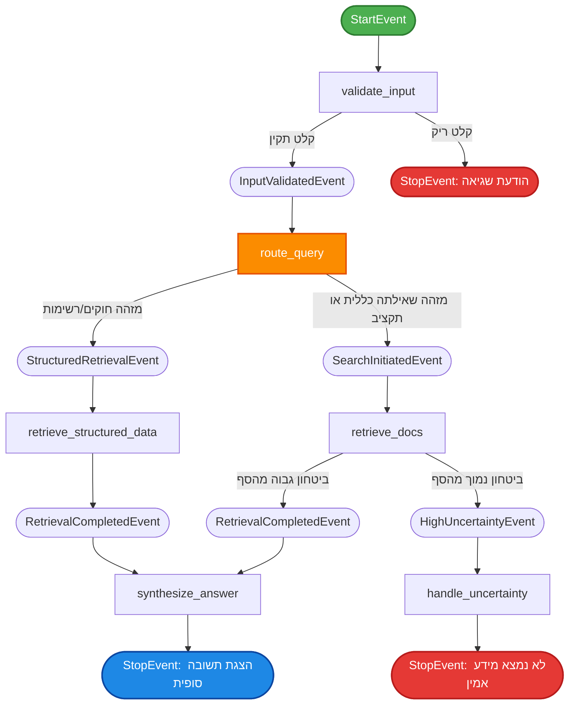

<div align="center">

# 🤖 Intelligent RAG Engine
### מערכת RAG אישית מבוססת אירועים (Event-Driven) לניהול מפרט ומשימות

<p>
  
  
  
  
</p>

</div>

---

<div dir="rtl" align="right">

## 📖 סקירה כללית

מערכת **RAG (Retrieval-Augmented Generation)** מתקדמת, המבוססת על ארכיטקטורת אירועים (**Event-Driven Architecture**) של **LlamaIndex**, ומוגשת באמצעות ממשק משתמש גרפי אינטראקטיבי שנבנה ב-**Gradio**.

בליבת המערכת פועל **נתב דינמי חכם (Smart Router)**, המבצע הפרדה מושכלת בין שני ערוצי שליפת מידע מקבילים — ערוץ **מובנה** (Structured) לשליפה מדויקת מנתונים מקומיים, וערוץ **סמנטי** (Semantic) לשליפה מבוססת הקשר מתוך מאגר וקטורי. גישה היברידית זו מבטיחה **דיוק מרבי**, **מזעור הזיות (Hallucinations)** של מודל השפה, והחזרת תשובות המבוססות אך ורק על מידע מאומת ואמין.

</div>

---

<div dir="rtl" align="right">

## 🎯 מטרת הפרויקט

הפרויקט נועד לספק למשתמשים ממשק תחקור אינטליגנטי, המאפשר שאילת שאלות חופשיות אודות מפרט מערכת ומשימות מורכבות, תוך זיהוי אוטומטי של **כוונת המשתמש (Intent)** וניתובה בצורה אופטימלית לערוץ העיבוד המתאים ביותר:

| סוג שאילתה | תיאור | ערוץ עיבוד |
|---|---|---|
| **שאילתות מובנות** | חוקים, דרישות פורמליות, רשימות סגורות | שליפה מדויקת מנתונים מקומיים |
| **שאילתות תוכן חופשי** | תקציבים, הסברים כלליים, הקשר רחב | שליפה סמנטית ממאגר וקטורי |

</div>

---

<div dir="rtl" align="right">

## 🧱 Tech Stack

</div>

| שכבה | כלי | למה זה נבחר |
|---|---|---|
| **Framework** | LlamaIndex (+ Workflows) | תמיכה native ב-RAG + Event-Driven Workflows |
| **Embeddings** | Cohere `embed-multilingual-v3.0` | 1024 dims, תומך עברית, cross-lingual |
| **Vector Store** | ChromaDB (local persistence) | מקומי, חינמי, אין rate limits |
| **Reranker** | Cohere `rerank-multilingual-v3.0` | מעלה דרמטית את איכות ה-top-K |
| **LLM** | Cohere `command-r-plus-08-2024` | תומך עברית מצוין, אומן ל-RAG |
| **UI** | Gradio | ממשק צ'אט מהיר עם פחות מ-100 שורות |

---

<div dir="rtl" align="right">

## 🔄 ארכיטקטורת המערכת (Workflow)

המערכת מתוזמרת באמצעות זרימת **שלבים (Steps)** ו-**אירועים (Events)** אסינכרוניים, בהתאם לפרדיגמת ה-Event-Driven Workflow של LlamaIndex. להלן תרשים הזרימה המלא של המערכת:

</div>



<div dir="rtl" align="right">

### 📋 פירוט שלבי הזרימה

| # | אירוע / שלב | תיאור |
|---|---|---|
| 1 | **StartEvent** → `validate_input` | קליטת השאלה וביצוע בדיקת תקינות (Validation) לקלט המשתמש, על מנת למנוע שאילתות ריקות |
| 2 | **InputValidatedEvent** → `route_query` | הנתב החכם משתמש במודל שפה (LLM) בליווי פרומפט מחמיר, להחלטה על נתיב השליפה האופטימלי |
| 3 | **StructuredRetrievalEvent** | ניתוב לשליפת מידע מדויק מתוך קובץ ה-JSON המקומי (`project_data.json`) |
| 3 | **SearchInitiatedEvent** | ניתוב לחיפוש סמנטי במאגר הוקטורי המקומי (ChromaDB), בכפוף לסינון קפדני לפי סף ביטחון מינימלי |
| 4 | **RetrievalCompletedEvent** | איסוף המקטעים הרלוונטיים שאותרו בשלבי השליפה, והעברתם לשלב הסינתזה |
| 5 | **synthesize_answer** | ניסוח תשובה סופית — מקוצרת, מדויקת ואמינה — בעברית, באמצעות ה-Chat API |

</div>

---

<div dir="rtl" align="right">

## 📦 The 5 Phases

הפרויקט נבנה באופן הדרגתי — כל שלב מוסיף יכולת אחת, **מבלי לשבור את השלבים הקודמים**.

</div>

| Phase | File | What it adds | Run it |
|---|---|---|---|
| 1️⃣ Indexing | `prepare.py` | Loads, chunks, embeds & stores documents in the vector store | `uv run prepare.py` |
| 2️⃣ Q&A App | `app.py` | A Gradio interface to ask questions | `uv run app.py` |
| 3️⃣ Workflow | `workflow.py` | Splits Q&A into observable event-driven steps | `uv run workflow.py "..."` |
| 4️⃣ Extraction | `extraction.py` | Returns a structured JSON summary | `uv run extraction.py` |
| 5️⃣ Routing | `router.py` | Auto-picks Q&A or extraction per request | `uv run router.py "..."` |

<div dir="rtl" align="right">

✅ **חמשת השלבים מיושמים במלואם ופועלים.**

</div>

---

<div dir="rtl" align="right">

## 📦 התקנה

### דרישות מוקדמות

- Python 3.10+
- מפתח API של [Cohere](https://cohere.com) (יש Free Trial)

### צעדים

**1. שכפול הפרויקט:**

</div>

```bash
git clone <repo-url>
cd rag-project
```

<div dir="rtl" align="right">

**2. התקנת תלויות:**

</div>

```bash
pip install -r requirements.txt
```

<div dir="rtl" align="right">

**3. הגדרת מפתח API:** צרי קובץ `.env` בשורש הפרויקט עם:

</div>

```
COHERE_API_KEY=your-cohere-key-here
```

<div dir="rtl" align="right">

**4. (חד-פעמי) חילוץ ה-structured data:**

</div>

```bash
python extract_data.py
```

<div dir="rtl" align="right">

זה לוקח כ-2-3 דקות ויוצר את `extracted_items.json` עם 52 rules, 54 decisions, ו-9 warnings.

**5. הפעלת הממשק:**

</div>

```bash
python app.py
```

<div dir="rtl" align="right">

הדפדפן ייפתח אוטומטית ב-`http://localhost:7860`.

### ⚠️ הערה לגבי Windows + DNS/SSL

הקוד משתמש ב-`truststore` כדי לפתור בעיית SSL נפוצה ב-Windows (מול Cohere/ChromaDB דרך urllib3). אין צורך בהגדרות נוספות.

### ⚠️ הערה לגבי Vector Store

המערכת המקורית תוכננה לעבוד עם **Pinecone**, אולם הכתובת של ה-Pinecone data plane חסומה ב-NetFree. לפיכך הוחלפה ל-**ChromaDB** מקומי — מבחינה קונספטואלית זהו אותו `VectorStoreIndex` של LlamaIndex — כאשר הנתונים נשמרים בתיקיית `/chroma_db`.

</div>

---

<div dir="rtl" align="right">

## 🚀 שימוש

### Gradio UI (העיקרי)

</div>

```bash
python app.py
```

<div dir="rtl" align="right">

פותח ממשק צ'אט ב-`http://localhost:7860`. לכל שאלה מתקבלים:

- 💬 **תשובה**
- 📊 **רשימת קבצים** שמהם הופקה התשובה
- 🔍 **Workflow trace** (אקורדיון פתיח) — מציג אילו Steps רצו ובאיזה סדר

</div>

---

<div dir="rtl" align="right">

## 🔍 רפלקציה

### על אילו שאלות ה-Agent לא מצליח לענות?

- **שאלות "למה"** עם תשובות שלא תועדו במפורש — הוא יצטרך להסיק (טוב), אבל גם לא יכול לעזור בכך (פחות טוב).
- **השוואות בין כלים** — למשל "במה Claude שונה מ-Copilot ב-routing?" — דורש איחוד מידע משני מקורות, וה-router לא מטפל בכך כרגע.
- **שאלות זמן אמיתיות** ("בשבוע האחרון") — הסכימה אינה כוללת `observed_at` תקני.

### האם ה-Router מזהה נכון איזה חיפוש להפעיל?

ברוב המקרים כן. הוא עובד טוב על דוגמאות ברורות ("רשימה של..." → structured, "מה הצבע" → semantic). נופל בשאלות עמומות ("ספר לי על routing" — יכולה להיות משני הסוגים).

### מה הייתי משדרגת?

1. **Hybrid execution** — להריץ גם structured וגם semantic ולמזג תוצאות.
2. **Conversation memory** — זיכור הקשרי של שאלות קודמות.
3. **timestamp אמיתי בסכימה** — כדי שתמיכה ב"בזמן האחרון" תעבוד באמת.
4. **רענון אינקרמנטלי** — extraction חדשה רק על קבצים שהשתנו.

### שינויים קטנים שהשפיעו דרמטית

- בלי `embed-multilingual-v3.0`, שאלות בעברית קיבלו ציוני דמיון רנדומליים במקום `english`.
- **CohereRerank** הזיז את התשובה הנכונה ממקום #3-#5 למקום #1-#2 — אותו retriever, איכות שונה לחלוטין.
- **Custom Hebrew prompt** + הנחיית "answer only from context" מנעה hallucination בשאלות מחוץ להקשר.

</div>

---

<div align="center">

made with 💡 by **Rivky Toledano**
<br>
**נוצר ע״י רבקי טולידאנו** ✨

</div>
